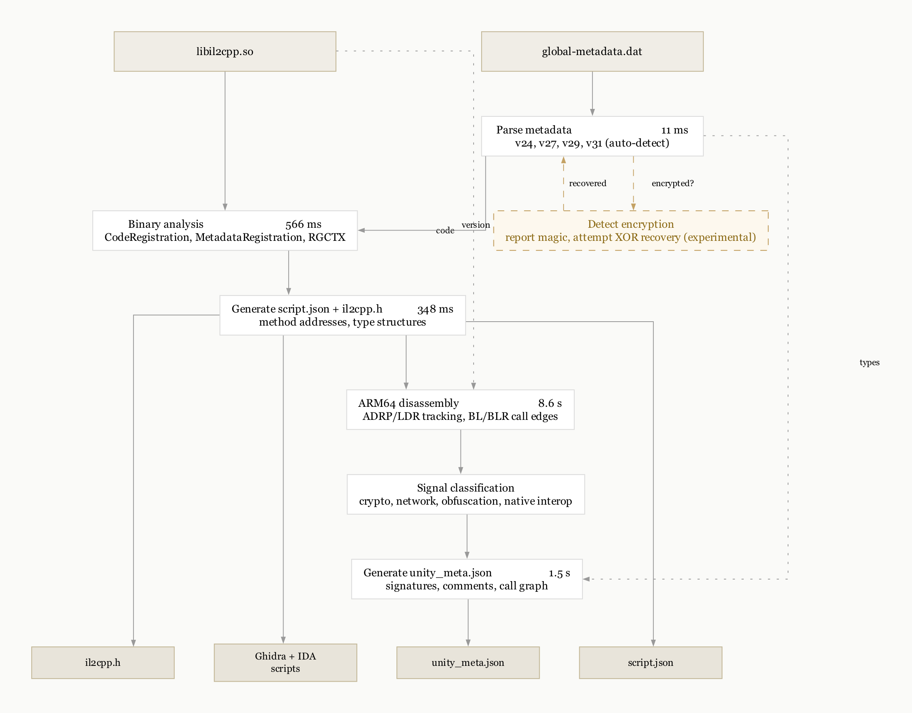
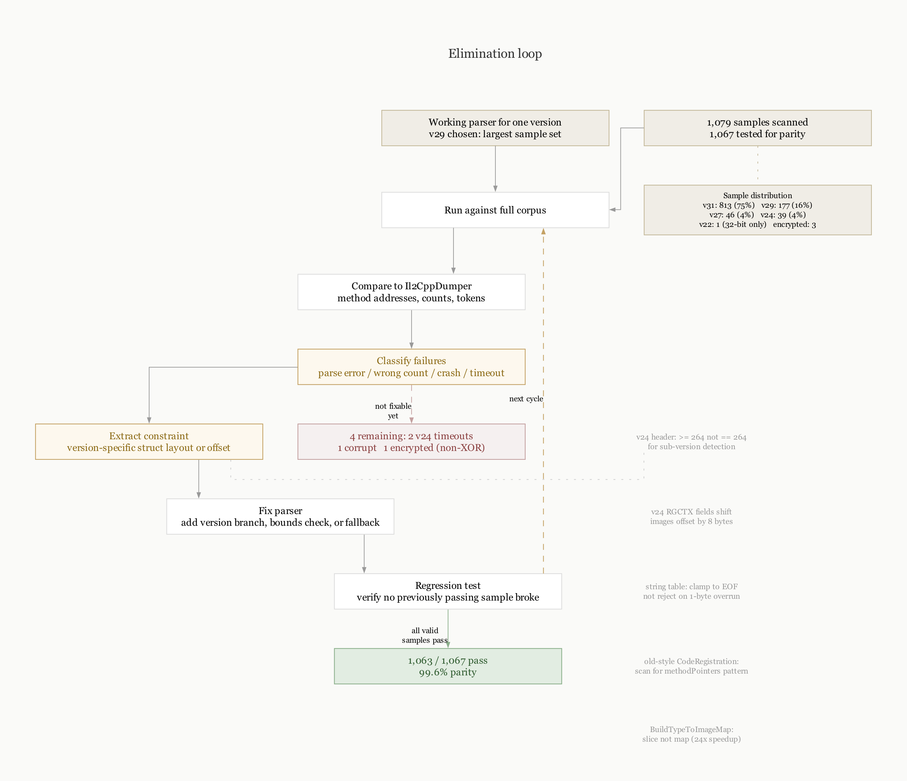

# disunity: static IL2CPP metadata extraction

## Overview

disunity is a static analysis tool for Unity IL2CPP ARM64 binaries.

It extracts method names, type hierarchies, and call relationships from:
- `libil2cpp.so`
- `global-metadata.dat`

without executing the binary.

The output is a structured JSON file that can be consumed by Ghidra or IDA to annotate large binaries quickly.

This is a proof of concept. It works well on the samples we have tested, but coverage of edge cases and newer IL2CPP versions depends on access to more samples.

## Scope

- ARM64 ELF (Android Unity apps)
- IL2CPP metadata versions 24, 27, 29, 31, 39 (Unity 6.3 LTS, 6.4), 106 (Unity 6.5 beta, 6.6 alpha)
- Unity 2017.1 through Unity 6000.x
- pure static analysis

v39 (Unity 6.3-6.4) and v106 (Unity 6.5+) are supported. Contributions of test samples for any other versions are welcome.

## Why build this

Existing tooling works, but breaks down under three pressures:
- scale
- reproducibility
- safety

At 50K to 100K methods per binary, the bottleneck is not extraction. It is how quickly you can get to the parts that matter and how reliable the pipeline is under malformed or adversarial input.

disunity was built to make the pipeline predictable and to reduce the amount of manual triage required after extraction.

## Signal extraction

Most IL2CPP binaries are dominated by framework code.

The useful behavior is concentrated in a small subset of methods:
- crypto
- network
- file I/O
- native interop
- dynamic loading

disunity classifies methods by behavior and builds a reduced call graph around those signals.

This lets you:
- identify encryption paths and keys
- locate network endpoints
- find dynamic loading paths

without stepping through tens of thousands of functions.

See [docs/samples.md](docs/samples.md) for walkthroughs on five real-world samples including AES/XXTEA/RSA detection, region cloaking, old-style v24 fallback, and encrypted metadata.

## Encrypted metadata

Some applications encrypt `global-metadata.dat`. disunity detects encrypted metadata by checking the magic bytes and reports the encryption.

The codebase includes experimental recovery support for XOR-encrypted metadata using Kasiski analysis, known-plaintext attacks on the IL2CPP header, and bounded brute force. This works for repeating XOR keys.

The one encrypted sample in our test corpus uses a non-XOR scheme (possibly AES or a custom cipher). Neither disunity nor Il2CppDumper can decrypt it. The XOR recovery path needs samples with actual XOR encryption to validate.

If you have XOR-encrypted metadata samples (FairGuard, custom XOR wrappers) we would like to test against them.

## Performance

Compiles from source in under a second. One dependency.

Extraction only comparison against Il2CppDumper on 23 real samples:

| Metric | disunity | Il2CppDumper |
| ------ | -------- | ------------ |
| Avg time | 1.4s | 3.8s |
| Median | 605ms | 2942ms |
| Faster cases | 22 | 1 |

On smaller binaries under 20K methods the gap is larger.

Full pipeline on a 91K method binary:
- metadata parse
- binary analysis
- disassembly
- call graph
- signal classification

Total time about 11 seconds on an M series Mac.

## Security findings in Il2CppDumper

During validation we treated Il2CppDumper as an input surface and applied the same elimination based methodology used for IL2CPP parsing.

### Method

1. Identify input boundaries:
   - PE loader
   - ELF loader
   - metadata parser
   - ULEB128 decoder
   - compression handlers
2. Generate targeted mutations:
   - truncated headers
   - offset overflows
   - malformed hash tables
   - invalid relocation entries
   - oversized length fields
3. Eliminate safe paths until only unstable behaviors remain.

This is not blind fuzzing. Each mutation targets a specific assumption in the parser.

### Results

#### Code execution via LoadLibrary

Il2CppDumper calls `LoadLibrary` on PE inputs as a fallback path.
If the file is attacker controlled, `DllMain` executes immediately.

Opening a malicious `GameAssembly.dll` runs code before any parsing.

#### Unsanitized identifiers in dump.cs

Type and method names from metadata are written directly into the generated `dump.cs` file. No filtering is applied.

The `il2cpp.h` output goes through `FixName()` which restricts characters to `[a-zA-Z0-9_]`. The `dump.cs` path does not.

This becomes a problem when `dump.cs` is consumed by anything other than a human reader. Modding frameworks, code generators, AI training pipelines, CI/CD scanners, and downstream parsers that treat `dump.cs` as either C# source or as a list of identifiers will receive whatever the metadata contained, including syntactically valid C# fragments embedded inside type names.

A crafted type name can introduce new declarations, terminate the enclosing class early, or inject attributes. Whether this matters depends entirely on what processes the file next. The inconsistency between `il2cpp.h` (sanitized) and `dump.cs` (not) suggests the gap is unintentional rather than a deliberate trade-off.

#### Denial of service vectors

We confirmed multiple crash and hang conditions:
- string offset overflow
- unbounded string reads
- GNU hash chain loops
- ULEB128 decoding loops
- oversized allocations
- relocation handling out of bounds

These are triggered with small malformed inputs.

### Why this matters

If you are using these tools on untrusted binaries, the tool itself becomes part of the attack surface.

disunity avoids this by design:
- no dynamic loading
- no code generation
- bounds checks on all table reads

Malformed input results in an error, not execution.

## Ghidra integration

Standard workflow:
- import binary
- run script
- wait for full re-analysis

On large binaries this takes 30 to 60 minutes.

disunity changes the order:
- disable unnecessary analyzers
- apply metadata
- exit before global re-analysis

Import time drops to minutes.

## Architecture



| Package | Purpose |
| ------- | ------- |
| `cmd/disunity` | CLI |
| `internal/metadata` | global-metadata.dat parser |
| `internal/binary` | CodeRegistration and MetadataRegistration analysis |
| `internal/disasm` | ARM64 disassembly and call graph |
| `internal/signal` | behavior classification |
| `internal/output` | export formats |
| `internal/pipeline` | orchestration |

## Parity

Tested against 1,067 real-world Unity IL2CPP samples from production Android apps.

1,063 produce correct output. 4 do not pass. No crashes. No wrong output.

| Version   | Unity         | Samples   | Pass      | Rate      |
| --------- | ------------- | --------- | --------- | --------- |
| v24       | 2017.1-2019.4 | 39        | 37        | 94%       |
| v27       | 2020.2-2021.1 | 45        | 45        | 100%      |
| v29       | 2021.2+       | 176       | 175       | 99%       |
| v31       | 2022.1+       | 806       | 806       | 100%      |
| **Total** | **all**       | **1,067** | **1,063** | **99.6%** |

The 4 failures:

- 2 v24 timeouts on large old-style binaries (pre-CodeGenModules scan is slow)
- 1 corrupt metadata (string offsets in the billions, Il2CppDumper also fails)
- 1 encrypted metadata (non-XOR scheme, neither tool decrypts it)

IL2CPP metadata versions 25, 26, 28, 30, 32-38, 40-105 are not used by Unity. The version numbers jump 24 to 27 to 29 to 31 to 39 to 106.

v39 (Unity 6.3 LTS and 6.4) introduced a new on-disk format with variable-width index encoding for some fields. v106 (Unity 6.5 beta and 6.6 alpha at time of writing) adds a typeInlineArrays section and extends variable-width encoding to many more index types. disunity supports both; Il2CppDumper rejects v39 and v106 with `Metadata file supplied is not a supported version[N]`.

The wider sample corpus (1,079 metadata files from production Android apps) shows a strong clustering toward recent Unity versions:

| Version   | Count | Share |
| --------- | ----- | ----- |
| v31       | 813   | 75%   |
| v29       | 177   | 16%   |
| v27       | 46    | 4%    |
| v24       | 39    | 4%    |
| v22       | 1     | <1%   |
| encrypted | 3     | <1%   |

Most apps in the wild use v29 or v31. Older versions are increasingly rare. v22 (Unity 5.5.x) exists but is not currently supported.

Versions beyond 106 are not yet observed in shipping Unity builds.

## Methodology

The tool was built using elimination rather than full specification.



Start from a working parser for one version. Test across versions. Remove assumptions until only stable structures remain.

Each version difference is treated as a constraint, not a special case.

The same approach was used for:
- signal extraction
- metadata decryption
- vulnerability discovery

## Usage

```bash
disunity libil2cpp.so global-metadata.dat

disunity signal libil2cpp.so global-metadata.dat

disunity meta libil2cpp.so global-metadata.dat

disunity ghidra libil2cpp.so global-metadata.dat
```

## Build

```bash
make build     # build ./disunity
make test      # run tests
make install   # install to ~/.disunity/
```

Single dependency: `golang.org/x/arch` for ARM64 instruction decoding.

## Related projects

disunity is part of a reverse engineering toolkit for mobile applications:

- [galago](https://github.com/nicloay/galago) - Cocos2d-x XXTEA key extraction and JSC decryption
- [deflutter](https://github.com/nicloay/deflutter) - Flutter/Dart symbol recovery from libapp.so
- [Il2CppDumper](https://github.com/Perfare/Il2CppDumper) - the established IL2CPP extractor (C#)
- [Il2CppInspectorRedux](https://github.com/LukeFZ/Il2CppInspectorRedux) - supports newer metadata versions (v35+)
- [Cpp2IL](https://github.com/SamboyCoding/Cpp2IL) - alternative IL2CPP tool with Mono Cecil integration

## License

MIT
